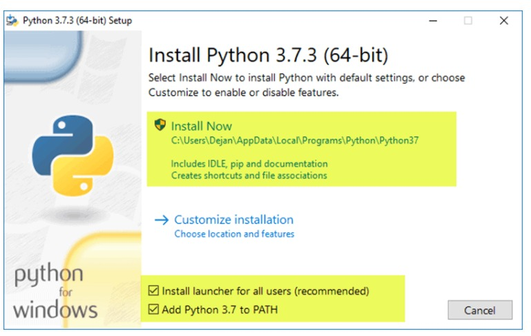

# work-of-breathing-UI
Software for obtaining PTP (Pressure-time product, a measure of breathing effort) values from respiratory data. Specifically, from Pes (esophageal pressure) and EAdi (electrical activity of the diaphragm) data obtained from patients with mechanical ventilatory assistance. Includes a user interface for displaying input signals and estimation of points of interest (start and end of inspiration).
 
# PTP estimation
The starting points for computing the Pes integral are obtained by first finding the inflection points of the curve. The inflection points are estimated as the intersection points of two smoothed versions of the original curve (using a gaussian filter with two different user-inputted sigma values). Then the starting points are obtained as the first local peak before each inflection point. 
 
The ending points of the Pes integral are computed as the points in which each Edi cycle reaches 75% of its amplitude after the cycle's peak. The starting points of each Edi cycle are estimated in the same way as the Pes's starting points.
 
The PTP for each inspiration cycle is finally computed as the area over the Pes curve from each Pes's starting point to the next ending point, as follows:
```
# Assuming the frequency of input data is 100 data points per second
CyclePTP = (PesData[startingPoint] * (endingPoint - startingPoint) - sum(PesData[startingPoint:endingPoint])) / 100
```
As shown in the user interface:
[picture]
 
# Installation
You need [Python](https://www.python.org/) installed. Its important to check the box "Add Python to PATH"
 


To easily set up the necessary python libraries to run the software for the first time on your computer, you can execute (double click) the _package_installer.py_ file in the _src_ folder. This will automatically install all [dependencies](#dependencies).
# Usage
### Input
Input data must consist of an excel file with a worksheet named: **Resumen para análisis**, in which the first two columns contain the synchronized (same length) EAdi and Pes data, in that order. Data values are read starting from the second row. All calculations are carried out under the assumption that the frequency of the input signals is **100 data points per second**.
### Interface usage
After executing main.py, the user interface will pop up. Choose the input file with *Abrir archivo* button and then press *Continuar*. If everything worked right you should see both signals (Edi and Pes) shown in interactive graphs.
 
You can now press _Calcular_ to compute and visualize the points of interest based on the smoothing values *Suavizado pequeño* and *Suavizado grande* (values shown at the right of input text boxes are the default values) You can also visualize the smoothed curves used in inflection point estimation by checking off the *Mostrar curva de suavizado* checkbox.
 
Note that *Suavizado pequeño* and *Suavizado grande* input values can not be equal or negative, otherwise the software will crash when trying to compute the inflection points.
### Output
You can use de *Exportar datos* button to generate output. The output consists of an excel file located at _/calculated_data_ folder, which will be automatically created in the same location as the executable file. The output file can be identified by the input file's name and a timestamp corresponding to it's time of creation. This excel file contains a worksheet named "results'', in which there are 13 columns:
* _n cycle_: Inspiration cycle identifier. The same number is shown in the interactive graphs.
* _integral value pes_: PTP value estimated for that inspiration cycle.
* _integral value edi_: Area between Edi curve and the Edi cycle minimum, from _start edi_ to _point 75%_.
* _start pes_: Datapoint used as starting point when computing the Pes integral.
* _start edi_: Datapoint considered the starting point for the Edi cycle.
* _point 75%_: Datapoint where the Edi curve reaches 75% of its total amplitude. Used as ending point when computing PTP.
* _t start pes->75%_: Time elapsed in seconds from _start_pes_ to _point_75%_
* _t start pes-> start edi_: Time elapsed in seconds from _start_pes_ to _start_edi_.
* _t start edi -> 75%_: Time elapsed in seconds from _start_edi_ to _point_75%_.
* _t start edi -> peak edi_:  Time elapsed in seconds from _start_edi_ to maximum value of the cycle
* _t start edi -> end edi_:Time elapsed in seconds from _start_edi_ to the start of the next cycle
* _edi Amplitude_: Amplitude of the Edi cycle.
* _pes Amplitude_: Amplitude of the Pes cycle.

**Note:** For output columns: _start pes_,  _start edi_ and _point 75%_, a value of 0 corresponds to the first datapoint of the input signal, 1 to the second, and so forth.
# Dependencies
* PyQt5
* openpyxl
* matplotlib
* scipy
 
 
